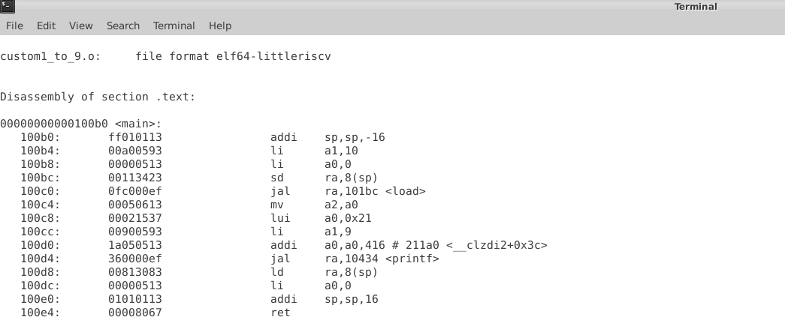
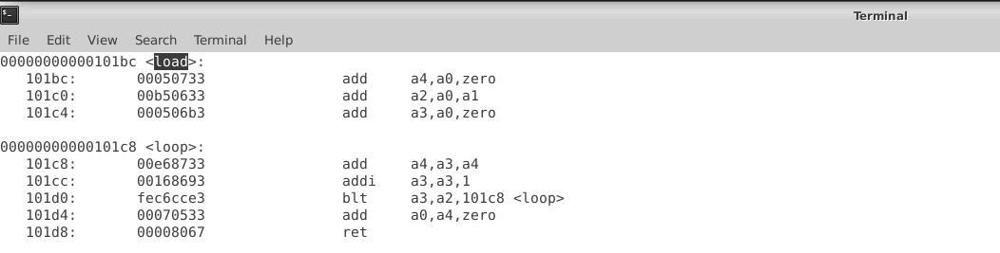
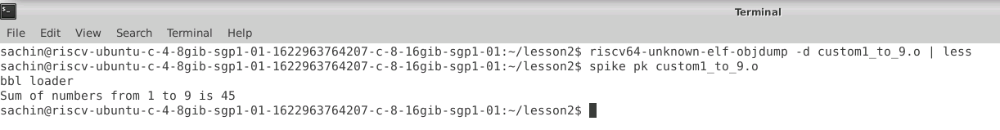

ABI
===

- Command to compile the code are `riscv64-unknown-elf-gcc -Ofast -mabi=lp64 -march=rv64i -o custom1_to_9.o custom1_to_9.c load.S` this is to a specific risc-v 64 bit cpu.

- Run the code `spike pk custom1_to_9.o`

- Observe the generated assembly code with `riscv64-unknown-elf-objdump -d custom1_to_9.o`

------------------------------------------------------------------

### Screenshot of the genrated compiled code

The [main](Images/main-asm.png) program

[load](Images/load-asm.png) assembly 

[output](Images/output-asm.png) of the code

